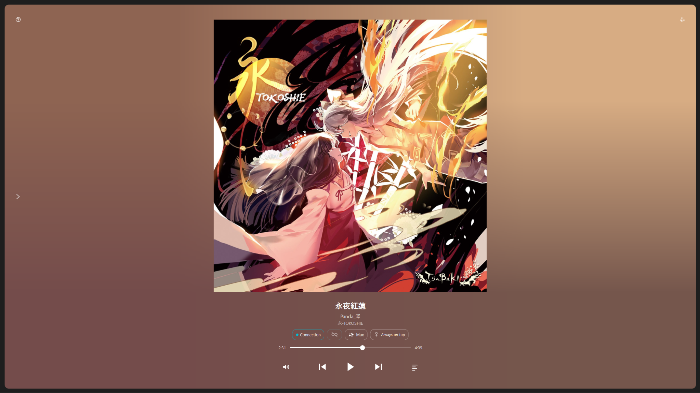
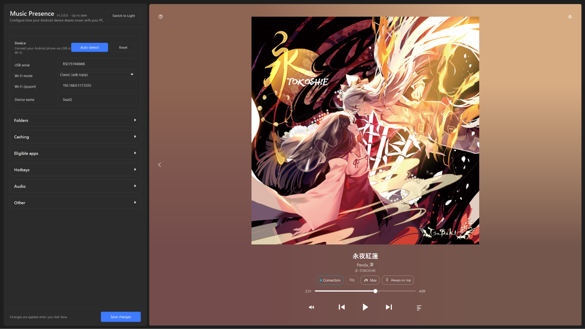
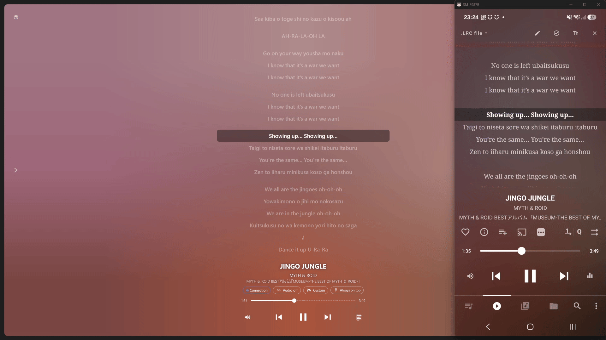
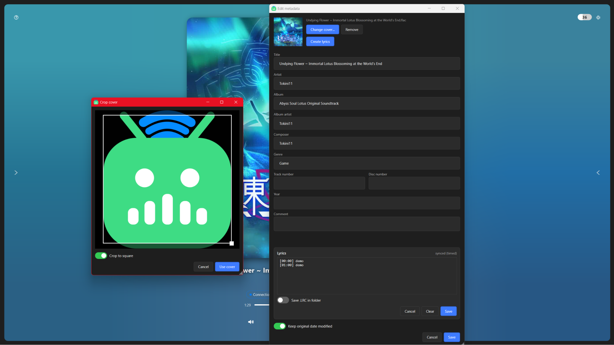
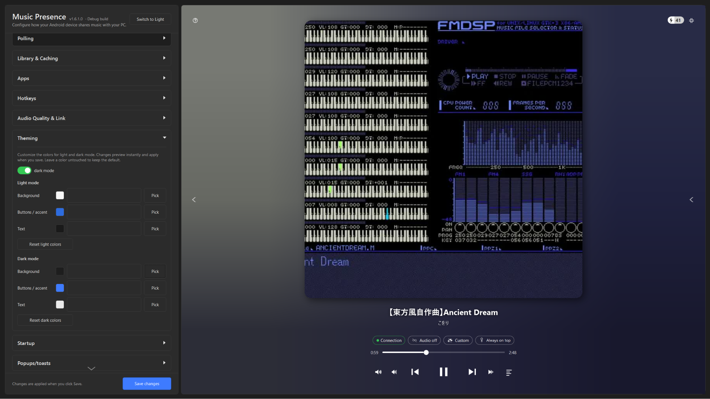
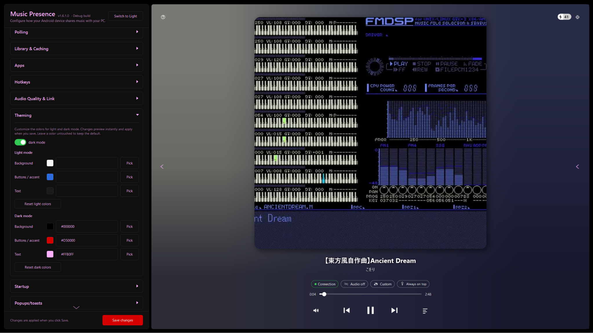

# Android Music Presence Link

Share what is currently playing on your Android device to Windows, and optionally forward it to Discord using [MusicPresence](https://github.com/ungive/discord-music-presence).
Built primarily to work alongside [MusicPresence](https://github.com/ungive/discord-music-presence), but can also be used independently.

---

<p>
  
  
</p>

---

## Who Is This For?

This app is made for:

- People who download all their music and use offline players
- People who dislike keeping two copies of their music, one on a phone and one on a PC
- People who want to share their currently playing media from their phone

If you mainly listen offline and want Discord Rich Presence without syncing your entire library to Windows, this is for you.

---

## Features

### Media Presence Forwarding

- Passes currently playing media from Android to Windows
- Can be forwarded to Discord using MusicPresence
- Reads title, artist, and album from the active Android media session
- Forwards presence to Windows SMTC (System Media Transport Controls), making it available to any app that reads SMTC
- Per-app presence modes: each allowed app can be set to Off, Half, or Full presence
- Cover art fetching can be enabled or disabled per app
- SMTC paused-clear delay: clears the Windows media session after a configurable number of minutes when paused (0 = disabled)

### Cover Art

- Automatically fetches album art from your phone and caches it locally
- Supports embedded cover art in audio files (extracted via ffmpeg)
- Supports folder-level cover images (e.g. `cover.jpg`, `cover.png`, `folder.jpg`)
- Cover filename patterns are configurable
- Configurable cache size limit with automatic LRU eviction

### Lyrics

- Pulls `.lrc` lyrics files from your phone over ADB
- Also reads lyrics embedded directly in audio file metadata
- Displays synced (timestamped) lyrics as a floating overlay on your desktop
- Also shows lyrics inline inside the media player window, replacing the cover art area
- Plain-text lyrics (no timestamps) are supported as a fallback
- Lyrics are cached locally to avoid re-fetching on every track change
- A custom lyrics folder override can be configured separately from music folders



### Metadata Editing

- Built-in editor for track metadata: title, artist, album, lyrics, and cover art
- Pulls the file from the device, lets you edit locally, and writes it back over ADB
- Lyrics can be saved embedded in the file or as a separate `.lrc` file (configurable per format; WAV always saves to `.lrc`)
- Optionally retains the original date modified when writing back



### Audio Link

- Streams audio from your Android device to your Windows PC in real time using scrcpy
- Customizable options:
  - Encoder selection (raw PCM, Opus, FLAC, AAC, and others detected from your device)
  - Buffer size control
  - Bitrate settings
  - FLAC compression level (1–8)
- Built-in quality presets: Data Saver, Default, High, Lossless, Max
- Custom values are saved and labeled as "Custom" in the UI
- Auto-restart on transport switch (USB to Wi-Fi or vice versa)
- Optional auto-restart when changing quality presets
- Bleedless mode: mutes the device briefly around restarts to prevent audio artifacts

### Controls

- Transport controls: play/pause, next, previous
- Skip back/forward 30 seconds (shown for tracks longer than 10 minutes)
- Volume control: a slider when the audio link is active, or +/- step buttons otherwise
- Configurable global hotkeys:
  - Volume up and volume down
  - Starting and stopping the audio link
  - Toggling the lyrics overlay
  - Copying current track info to the clipboard
  - Cycling through audio quality presets
- Hotkey modifier is configurable (Shift, Ctrl, or Alt)
- Copy-to-clipboard template is customizable (supports `{artist}`, `{title}`, `{album}`)

### Next Song Prediction

- Shows the previous, current, and next track based on your library's folder structure
- Display modes: off, text only, full cover art, or Kirsten mode
- Sorting options: filename A–Z / Z–A, date modified newest / oldest
- Cover art is fetched in the background for neighboring tracks
- Manual library rescan available from the UI

### Interface

- Two view modes: a full settings window and a compact media player window
- Media player view shows cover art, animated gradient background extracted from album art, track info, progress bar, and transport controls
- Can be run fully headless: start minimized to tray and control everything through hotkeys, never opening a window
- Inline lyrics panel replaces the cover art area when toggled
- Dark mode and light mode with fully customizable color overrides for both
- Always-on-top toggle
- Hide-decorations toggle (removes title bar and borders; window stays movable and resizable)
- Rounded corners and shadow options for cover art and text
- Artist and album display order is swappable
- Elapsed or remaining time display, togglable per session
- Animated gradient: configurable number of color sample points (2, 4, 6, or 8)
- Connection status pill showing USB/Wi-Fi state
- Audio quality button showing the current preset, with a popup to switch presets without opening settings
- Battery indicator with three styles (Classic, Pill, Vertical), configurable percentage and charging bolt placement
- Extensive per-element visibility toggles: title, artist, album, cover, volume button, lyrics button, battery, seek buttons, and more
- Settings pane inside the media player can be docked left or right
- System tray icon with state-specific icons for USB, Wi-Fi, audio link active, and no device
- Now Playing shown in the tray tooltip and tray menu
- Toast notifications for connection changes and audio link events, with configurable position (corners or center) and display mode
- Start minimized to tray option
- Start with Windows option
- Debug logging with a log folder shortcut in settings

https://github.com/user-attachments/assets/e3e81442-0b3d-4246-9e76-ede8271d60ff

<p>
  
  
</p>

### Connection

- USB connection support
- Optional Wi-Fi connection via either classic ADB `tcpip` or Android 11+ Wireless Debugging
- USB-only mode
- Wireless Debugging pairing support via QR code or pairing code with mDNS-based reconnects after the device restarts or changes IP
- Automatic Wi-Fi recovery when the port is lost, prompting you to reconnect USB and re-establish the wireless bridge
- Auto-detect button in setup that finds your device, optionally configures Wi-Fi, and asks for a friendly device name
- Polling rate configurable: Extreme, Fast, Medium, or Slow
- Adaptive polling: automatically reduces polling frequency after a configurable number of minutes of being paused

### Onboarding

- Step-by-step setup wizard covering USB debugging, device connection, Wireless Debugging pairing, music folders, allowed apps, hotkeys, and startup options
- Can be re-run at any time from settings

<!-- demo: video walking through the onboarding wizard -->

### Portable Mode

- If a `portable.mode` file is placed next to the executable, all data is stored in the app directory instead of AppData

---

## Devices Tested and Known Working

- Redmi Note 13
- Redmi Note 15
- Samsung S25 Edge
- Samsung S10 (Audio Link does not work due to Android 12)

---

## Requirements

- Android phone running **Android 13 or newer** (Android 11 and 12 may work partially, but Audio Link will not function and other features may behave incorrectly)
- Android 14 and 15 are currently untested — if you encounter issues, please open an issue
- No Apple or iOS support (duh)
- USB debugging must be enabled on your phone
- Uses ADB (Android Debug Bridge) to establish the connection
- Wireless Debugging mode requires Android 11+
- scrcpy is required for the Audio Link feature

Without USB debugging enabled, the app will not work.

---

## Known Issues and Compatibility

### Media Player Compatibility

- Fully tested with Musicolet and Symfonium
- Most Android music players should work if they expose media session data
- If a player does not work, please open an issue

### Folder Structure

Tested structure:

```
Main Folder
├── Random Unsorted Music
└── Album Name
    ├── track1.mp3
    ├── track2.mp3
    └── cover.png or cover.jpg
```

Notes:

- No guarantee for deeply nested folder structures
- If the track title and filename do not match, the wrong cover or no cover may be pulled
- If all songs contain embedded cover art in metadata, it should work reliably
- Multiple music root folders can be configured

### Seeking

- The progress bar is read-only. Arbitrary seeking from Windows to Android is not supported over ADB.
- The app ticks the position forward manually between polls. The 30-second skip buttons use ADB media key events, which let the playing app handle the actual seek amount.

### Wireless Mode

- Wireless mode may have stability issues on some mobile devices, especially laptops

---

## Why This Exists

Many users:

- Keep their music offline
- Prefer Android music players
- Do not want to duplicate large libraries on their PC
- Still want Discord Rich Presence integration

This project bridges that gap.
